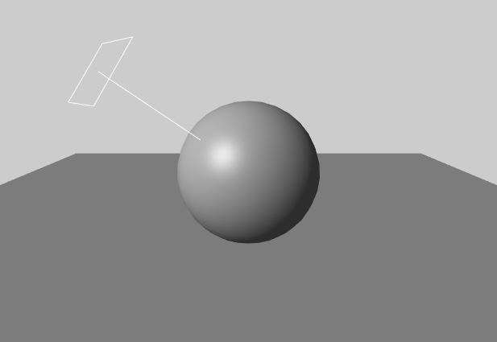
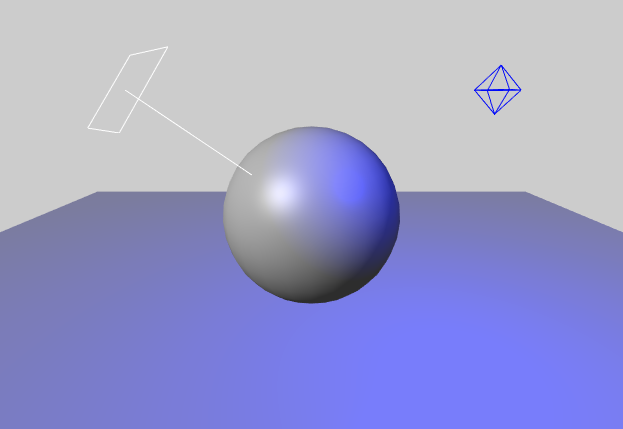
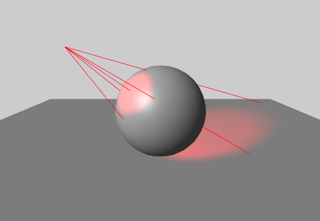

# Hellow Three.js 之 光影之谜

> [Demo查看](../demo/hello-threejs/hello-light.html)


## 基础知识

常识，发光到物体即光源，有光，就有影。要想体现物体的3D真实性，光影就是很重要的效果。
在threejs的世界里，也为光源提供了很多选择。

### Light 光源基类

Light 是 Threejs 里所有光源的基类

`Light( color : Integer, intensity : float )`

- color — 光源颜色的RGB数值, 接受一个16进制的颜色值 如: `0xffffff` 表示白色
- intensity — 光源强度的数值

### 各种派生类

- AmbientLight 环境光
- DirectionalLight 平行光
- HemisphereLight 半球光
- PointLight 点光源
- RectAreaLight 矩形区域光源
- SpotLight 聚光源

#### 1、AmbientLight 环境光

环境光故名思意，是光线经过周围环境多次反射而来的光，没有确定的方向。


`AmbientLight( color, intensity )`

- color — 光源颜色的RGB数值。
- intensity -- 光源强度的数值。

```
var amblight = new THREE.AmbientLight( 0x404040 );
scene.add( amblight );
```

#### 2、DirectionalLight 平行光

从一个特定的方向，而不是从一个特定的位置。这个光看起来就像光源位于无限远处，因此它产生的光线都是平行的。
比如太阳，因为太阳很遥远，看起来所有的阳光照射到物体上都几乎来自同一个角度。



`irectionalLight( hex, intensity )`

- hex -- 光源颜色的RGB数值。
- intensity -- 光源强度的数值。

```
var directionalLight = new THREE.DirectionalLight( 0xffffff, 0.5 );
directionalLight.position.set( 0, 1, 0 );
scene.add( directionalLight );
```

#### 3、PointLight 点光源

点光源：某个位置特定的发光点，比如灯泡、蜡烛、萤火虫等



`PointLight( color, intensity, distance, decay )`

- color — 颜色的RBG数值。
- intensity — 光强的数值。
- distance -- 光强为0处到光源的距离，0表示无穷大。
- decay -- 沿着光照距离的衰退量。

```
var light = new THREE.PointLight( 0xff0000, 1, 100 );
light.position.set( 50, 50, 50 );
scene.add( light );
```

#### 4、SpotLight 聚光源

一种能投射锥形阴影区域的点光源，比如探照灯。



`SpotLight( color, intensity, distance, angle, penumbra, decay )`

- color — 颜色的RBG数值。
- intensity — 光强的数值。
- distance -- 光强为0处到光源的距离，0表示无穷大。
- angle -- 光线散射角度，最大为Math.PI/2。
- penumbra -- 聚光锥的半影衰减百分比。在0和1之间的值。默认为0。
- decay -- 沿着光照距离的衰退量。

```
// 白色聚光灯从侧面发光，投射阴影
var spotLight = new THREE.SpotLight( 0xffffff );
spotLight.position.set( 100, 1000, 100 );

spotLight.castShadow = true;

spotLight.shadow.mapSize.width = 1024;
spotLight.shadow.mapSize.height = 1024;

spotLight.shadow.camera.near = 500;
spotLight.shadow.camera.far = 4000;
spotLight.shadow.camera.fov = 30;

scene.add( spotLight );
```

## 材质与光源

物体的材质在渲染的时候，和光源有很重要的关系。比如，物体的纹理、色彩、透明度、光滑度、折射率、反光率等。

要想体现材质等真实性，光体现了很主要的效果，如果没有光，都是黑漆漆的，我们眼睛估计无法分辨物体的形态。

走夜路，打手电，通过光我们能分辨路上的石头、树枝、坑洞等。

-------

本文部分内容参照及引用：

> [three.js docs](https://threejs.org/docs/index.html#api/lights/AmbientLight)
